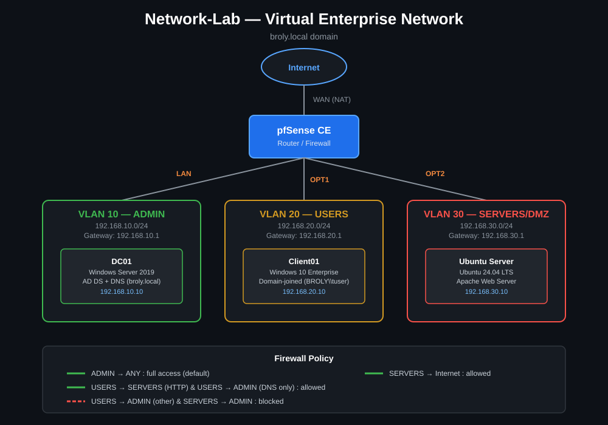
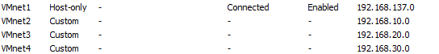
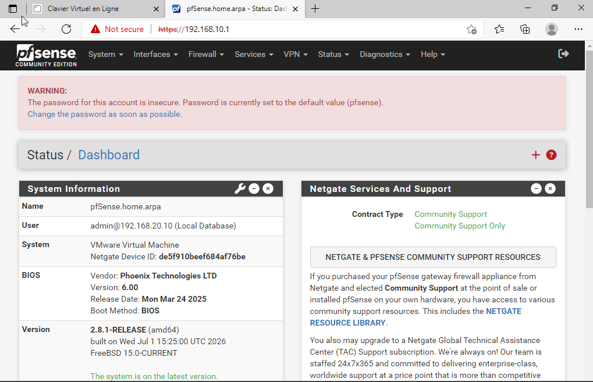
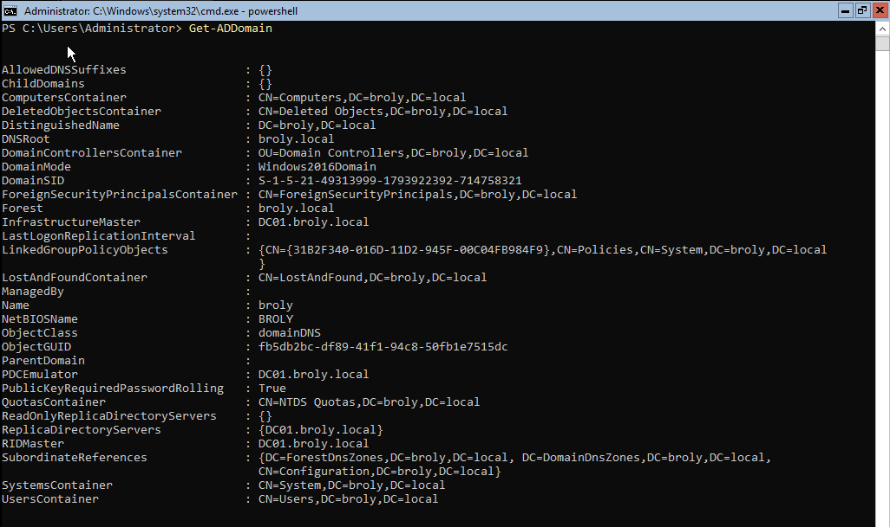
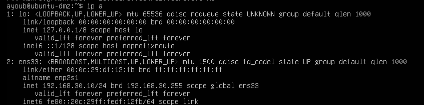
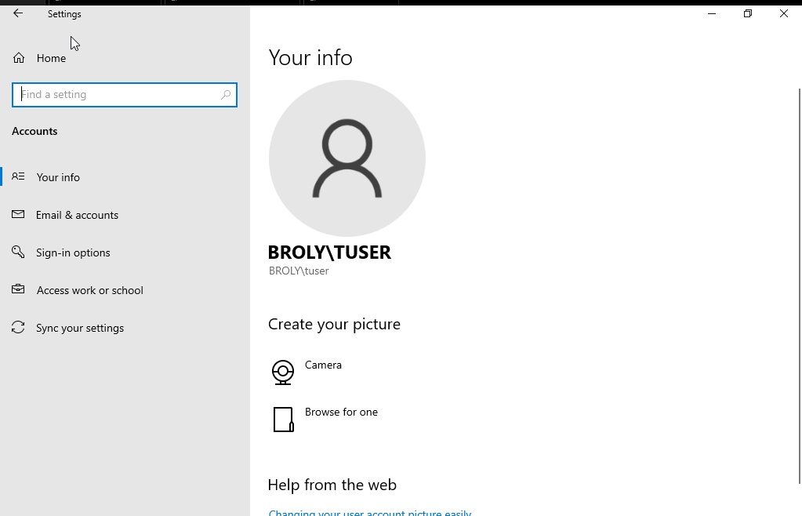
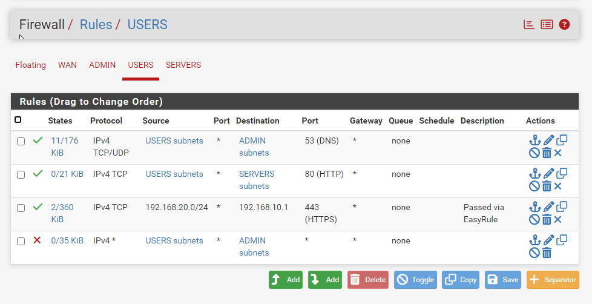
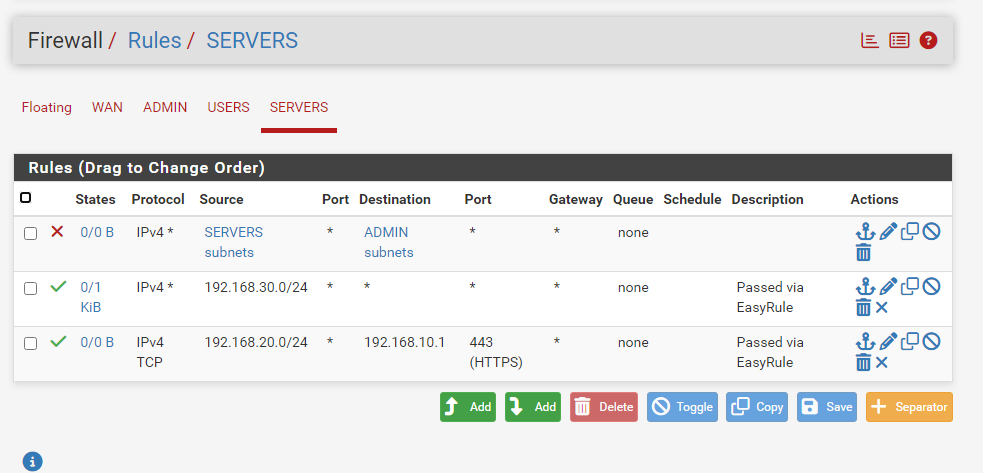
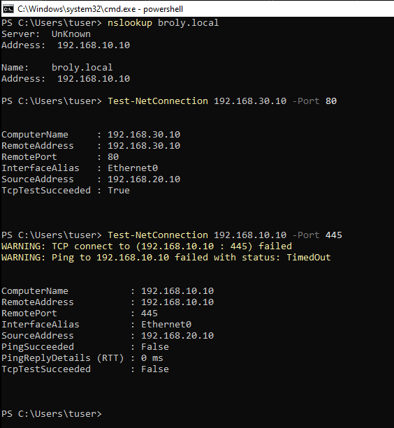
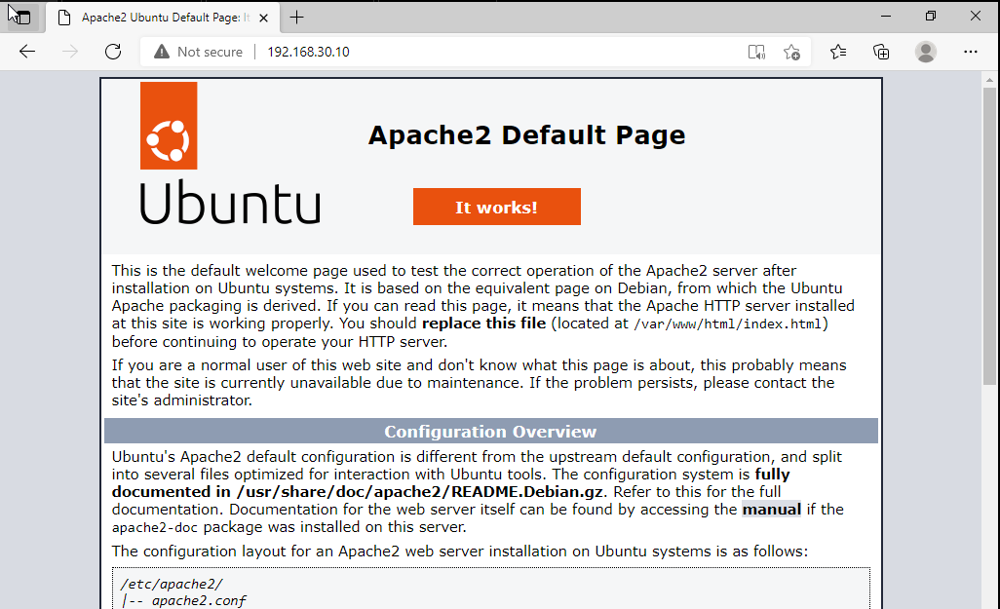

# Network-Lab | Virtual Enterprise Network

## Overview
This is my first cybersecurity lab project, where I built a **virtual network** simulating a small company environment. The goal was to practice **network segmentation, firewall rules, Active Directory, and DNS** in a safe, isolated lab — all running on a single 8GB RAM host machine.

The network is split into 3 VLANs (Admin, Users, Servers/DMZ), routed and firewalled by pfSense, with a domain-joined Windows client, a Windows Server domain controller, and a Linux web server.

---

## Tools & Technologies
- **Virtualization:** VMware Workstation Pro (25H2)
- **Firewall/Router:** pfSense CE 2.8.1
- **Servers:** Windows Server 2019 (Server Core — AD DS, DNS), Ubuntu Server 24.04 (Apache)
- **Clients:** Windows 10 Enterprise Evaluation (domain-joined)
- **Other Tools:** pfSense built-in Packet Capture, PowerShell, `easyrule` (pfSense CLI)

---

## Network Design

| VLAN | Purpose | Subnet | pfSense Interface | Key Device |
|------|---------|--------|--------------------|------------|
| 10 | Admin | 192.168.10.0/24 | LAN | DC01 (Windows Server) — 192.168.10.10 |
| 20 | Users | 192.168.20.0/24 | OPT1 | Client01 (Windows 10) — 192.168.20.10 |
| 30 | Servers/DMZ | 192.168.30.0/24 | OPT2 | Ubuntu Server (Apache) — 192.168.30.10 |

- **pfSense** acts as the router and firewall between all three VLANs.
- **Domain:** `broly.local` (NetBIOS: `BROLY`), managed by DC01.
- **Firewall policy:**
  - Admin → full access to everything (default)
  - Users → allowed DNS (to Admin) and HTTP (to Servers), blocked from everything else on Admin
  - Servers → blocked from Admin, allowed outbound internet access



---

## Setup Steps

1. **Created 3 isolated virtual networks** in VMware's Virtual Network Editor (Host-only, no VMware DHCP), one per VLAN, plus NAT for WAN.
2. **Installed pfSense CE** with 4 interfaces (WAN, LAN, OPT1, OPT2), assigned static gateway IPs per VLAN.
3. **Installed Windows Server 2019 (Server Core)**, configured via `sconfig`, promoted to Active Directory Domain Controller for `broly.local` using `Install-ADDSForest`.
4. **Installed Ubuntu Server 24.04**, configured a static IP, and deployed Apache as a demo web service.
5. **Installed Windows 10 (Enterprise Evaluation)**, set a static IP, and joined it to the `broly.local` domain.
6. **Created firewall rules** on pfSense enforcing the segmentation policy above, and verified them with live connectivity tests.
7. **Captured live traffic** with pfSense's packet capture tool to confirm real cross-VLAN traffic and firewall enforcement.

---

## Screenshots / Proof












### Segmentation test results

From the Windows 10 client, logged in as a regular domain user (`BROLY\tuser`):

```powershell
# DNS to Admin (DC01) — allowed
nslookup broly.local
→ Success

# HTTP to Servers (Ubuntu/Apache) — allowed
Test-NetConnection 192.168.30.10 -Port 80
→ TcpTestSucceeded: True

# SMB to Admin (DC01) — blocked
Test-NetConnection 192.168.10.10 -Port 445
→ TcpTestSucceeded: False
```

From the Ubuntu server (Servers/DMZ VLAN):

```bash
# To Admin (DC01) — blocked
ping -c 4 192.168.10.10
→ 100% packet loss

# To internet — allowed
ping -c 4 8.8.8.8
→ 0% packet loss
```

### Packet capture analysis

Captured on pfSense's USERS interface (em2) while browsing from the Windows 10 client (`192.168.20.10`) to the Ubuntu web server (`192.168.30.10`). The capture shows a complete TCP handshake, HTTP transfer, and connection teardown — confirming real traffic crossing the VLAN boundary through pfSense as designed:

```
192.168.20.10 → 192.168.30.10   TCP  SYN            (client initiates connection)
192.168.30.10 → 192.168.20.10   TCP  SYN, ACK        (server responds)
192.168.20.10 → 192.168.30.10   TCP  ACK             (handshake complete)
192.168.20.10 → 192.168.30.10   TCP  ACK, PSH        (HTTP GET request sent)
192.168.30.10 → 192.168.20.10   TCP  ACK, PSH        (Apache response data)
192.168.30.10 → 192.168.20.10   TCP  ACK, PSH        (Apache response data, continued)
192.168.20.10 → 192.168.30.10   TCP  ACK             (client acknowledges)
192.168.30.10 → 192.168.20.10   TCP  ACK, FIN        (server closes connection)
```

---

## Challenges

- **Netgate's installer no longer ships separate CE ISOs.** The unified Netgate Installer defaults toward pfSense Plus during the subscription validation step — had to explicitly select "Install CE" to stay on the free Community Edition.
- **Arabic AZERTY keyboard layout mismatch** during Windows Server and Windows 10 setup caused garbled password input (typed characters didn't match what appeared). Resolved by selecting the correct keyboard layout at the Windows Setup language screen, and by using VMware Tools for reliable copy-paste once installed.
- **AD DS promotion stalled for over an hour** on a 2GB RAM VM. Diagnosed via host Task Manager and VM responsiveness checks, then resolved by bumping the VM to 3GB RAM and reinstalling cleanly with VMware Tools already in place.
- **pfSense blocks all traffic on new OPT interfaces by default**, including traffic to the firewall's own IP (e.g. a simple ping to the gateway) — not just genuinely public traffic. Learned to use `easyrule` from the console for quick fixes, and the GUI for permanent, ordered rules.
- **Rule ordering matters.** pfSense evaluates firewall rules top-to-bottom with first-match-wins. A Block rule placed above a Pass rule silently overrides it — had to learn to drag-reorder rules in the GUI and verify actual behavior with `pfctl -sr` rather than trusting the rule list alone.
- **"Address" vs "Subnets" in pfSense's source/destination dropdowns** look similar but mean very different things — "address" only matches pfSense's own interface IP, while "subnets" matches the actual devices on that VLAN. This caused rules to silently not match any real traffic until corrected.
- **Leftover troubleshooting rules can undermine security policy.** A broad "pass any" rule added via `easyrule` while debugging connectivity was still active later, unintentionally allowing blocked traffic through — a good reminder to audit and clean up temporary rules before considering a firewall policy finished.

---

## Learning Notes
- Learned how to **segment a network** using VLANs and enforce it with a real firewall, not just theory.
- Configuring **firewall rules** between different subnets was the most practical and revealing part of the whole lab — small misconfigurations (wrong dropdown option, wrong rule order) had very real, testable effects.
- **Active Directory** integration made centralized identity management concrete: one account, verified by one server, working across every domain-joined machine.
- Using **pfSense's packet capture** helped visualize the actual TCP handshake and HTTP exchange — packets aren't abstract once you can see them cross a VLAN boundary in real time.
- Working under real hardware constraints (8GB RAM host) forced practical decisions — Server Core over full GUI, one VM running at a time, thin-provisioned disks — that mirror real-world resource planning.

---

## Next Steps
- Add a **SIEM server** (Wazuh/ELK) to collect logs from pfSense, DC01, and Ubuntu — this network is the foundation for the next project, **SIEM-Lab**.
- Create **vulnerable machines** (e.g. Metasploitable2) on the Servers/DMZ VLAN to simulate attacks.
- Automate deployment using **Vagrant or Ansible**.
- Tighten the firewall policy further — restrict pfSense's own GUI access to the Admin VLAN only, rather than the temporary Users-to-GUI rule used during setup.

---

**Author:** Ayoub Khachane
